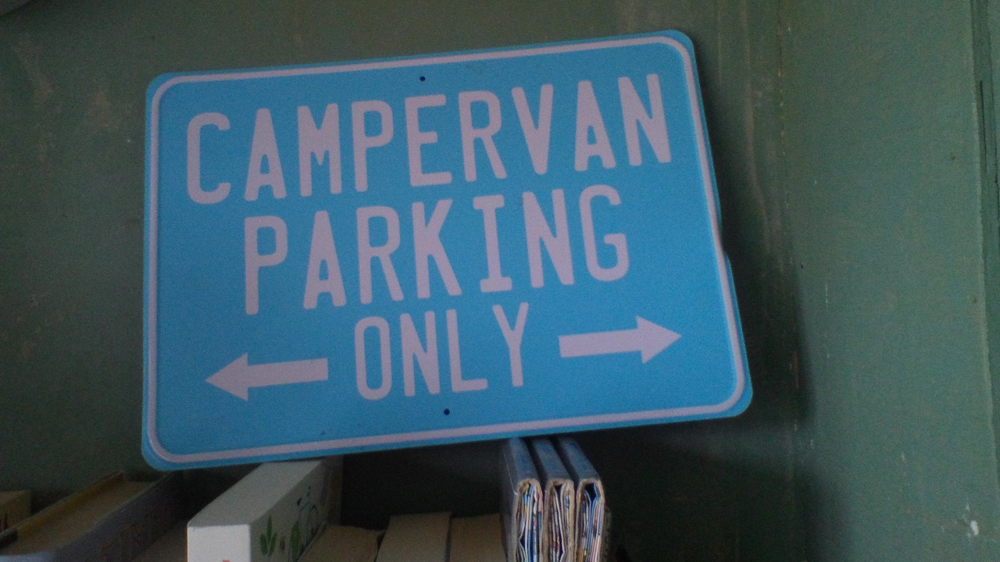

**Pragmatic Software Engineer and Trainer**

RESTful API development,  implementing micro-services using Java 9/11, Ubuntu Linux, and Docker.

Automation and DevOps advocate *(you don't want to pass it to Ops, unless it's documented, they will pass it gracefully back).*

Love "Getting Started" demos and tutorials, which are running in thirty minutes :) 

- 🔭 My current side-project is developing an Art website for my father.  Intuitive, which will "generate" a static site.  With full infrastructure automation.
- 🌱 I’m currently learning The Go Programming Language.
- 🌱 Love Lucene, and RabbitMQ.   
- 💬 Ask me about **C**ycling, **Hector** the camper, **P**hotography, *and stuff which just works*.
- 📫 milesd@chocksaway.com

[milesdavenport.com](https://milesdavenport.com "Miles Davenport")

[chocksaway.com](https://chocksaway.com "chocksaway")

[klartraining.com](https://klartraining.com "klartraining")

